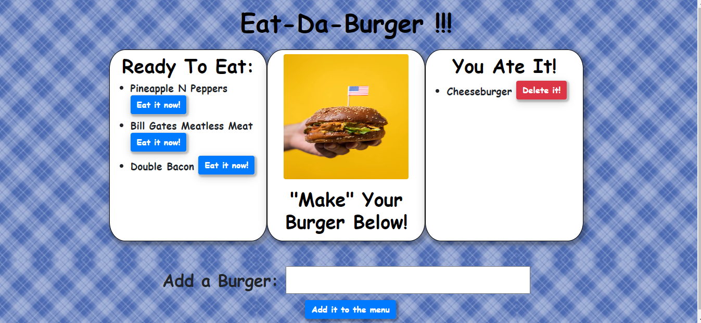

<h1 align="center">Welcome to burger 👋</h1>
<p>
  <a href="https://www.npmjs.com/package/burger" target="_blank">
    
  </a>
  
  <a href="https://github.com/kcnancy/burger#readme" target="_blank">
    
  </a>
  <a href="https://github.com/kcnancy/burger/graphs/commit-activity" target="_blank">
    
  </a>
  <a href="https://github.com/kcnancy/burger/blob/master/LICENSE" target="_blank">
    
  </a>
</p>


## Table of Contents
  - [Description](#description)
  - [Homepage](#homepage)
  - [Installation](#installation)
  - [Usage](#usage)
  - [Author](#author)
  - [Contributions](#contribution)
  - [License](#license)


### Description 
> node express handlebars project

### 🏠 [Homepage](https://github.com/kcnancy/burger#readme)
### 🏠 [Deployed App](https://quiet-crag-51716.herokuapp.com/)


## Installation

```sh
npm install
```

## Usage

```sh
npm run start
```

This app allows the user to name a burger and submit it to the menu, once on the menu the user can 'eat' the burger by clicking the 'Eat it now' button. Once the burger is eaten it moves to the You ate it box and can be deleted from the screen if the delete button is clicked.




## Author

* Website: https://kcnancy.github.io/NancyMcBride-Portfolio/
* Github: [@kcnancy](https://github.com/kcnancy)


## 📝 License

This project is [MIT](https://github.com/kcnancy/burger/blob/master/LICENSE) licensed.

***
_This README was generated with ❤️ by [readme-md-generator](https://github.com/kefranabg/readme-md-generator)_
